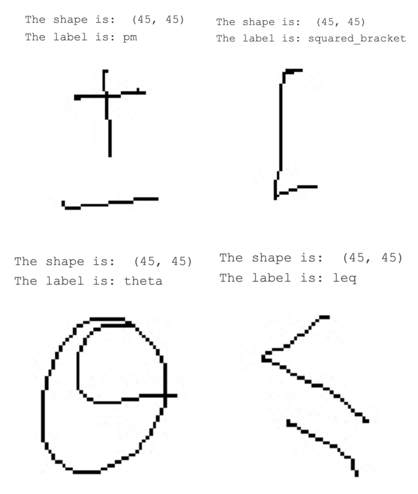
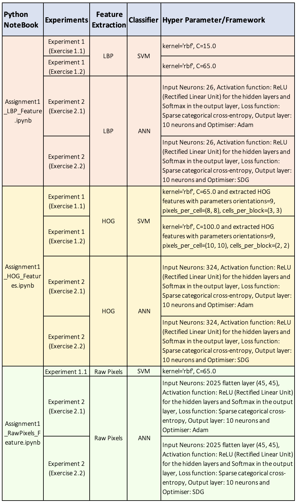
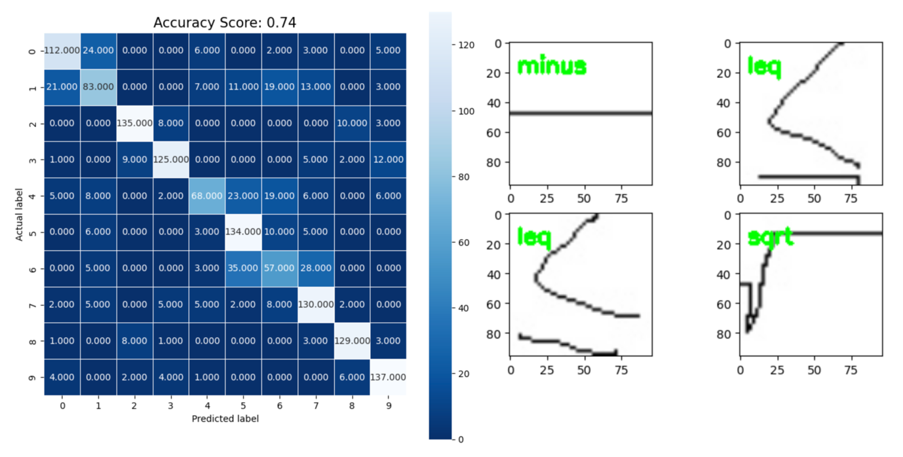
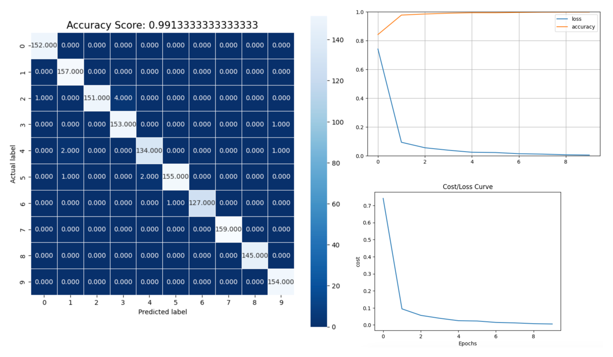
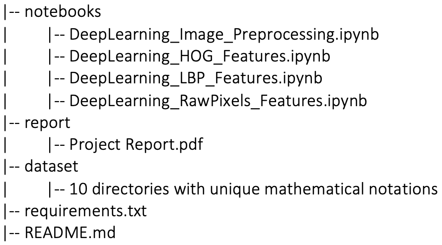

##  Handwritten Mathematical Symbol Recognition Using Support Vector Machines and Neural Networks with Different Feature Extraction Methods

### **<u>Project Overview</u>**

This project focuses on handwritten mathematical symbol recognition and
classification using machine learning models. It involves developing
models that can accurately recognize and categorize handwritten
mathematical symbols commonly used in mathematical notation from images.
The project uses two classifiers: Support Vector Machines (SVM) and
Artificial Neural Networks (ANN), along with three feature extraction
techniques: Histogram-Of-Oriented-Gradients (HoG), Local Binary Pattern
(LBP), and raw image pixels. The project includes a total of six
experiments combining these classifiers and feature extraction methods.

### **Feature Extraction Techniques**

-   **Histogram-Of-Oriented-Gradients (HoG):** Captures shape and
    structure information by calculating the distribution of gradient
    orientations in an image.

-   **Local Binary Pattern (LBP)**: A texture descriptor that quantifies
    the local structure of an image by comparing each pixel with its
    neighbouring pixels.

-   **Raw Image Pixels**: The intensity values of individual pixels in
    an image.

### **Classifiers**

-   **Support Vector Machines (SVM)**: A supervised learning model that
    analyses data for classification and regression analysis.

-   **Artificial Neural Networks (ANN)**: A computational model inspired
    by the way biological neural networks in the human brain process
    information.

### **<u>Datasets</u>**

The dataset consists of handwritten images of 10 different mathematical
symbols. Each symbol is stored in a separate folder. The images have a
resolution of 45x45 pixels and are in uint8 format.

Few Images of some unique symbols.

Note: For detailed dataset information please refer to section 2:
Visualising and Exploring images from the
DeepLearning\_Image\_Preprocessing.ipynb notebook and Project Report.

### **<u>Experimental Settings:</u>**

The table below provides details regarding the configuration of
classifiers used in various experiments conducted for this image
classification task.

### **<u>Experimental Results:</u>**

The below table presents the highest accuracy score for each feature
extraction technique and employed classifier model.

<table>
<colgroup>
<col style="width: 28%" />
<col style="width: 25%" />
<col style="width: 20%" />
<col style="width: 25%" />
</colgroup>
<thead>
<tr>
<th><strong>Classifier/Feature</strong></th>
<th><strong>LBP</strong></th>
<th><strong>HOG</strong></th>
<th><strong>Raw Input</strong></th>
</tr>
</thead>
<tbody>
<tr>
<td>SVM</td>
<td>
Train: 74.36

Test: 74.00
</td>
<td>
Train: 100

Test: 99.47
</td>
<td>
Train: 100

Test: 97.73
</td>
</tr>
<tr>
<td>ANN</td>
<td>
Train: 51.21

Test: 53.27
</td>
<td>
Train: 99.89

Test: 99.13
</td>
<td>
Train: 93.86

Test: 89.13
</td>
</tr>
</tbody>
</table>

Below are the confusion matrixes for these highest accuracy scores
classifiers and features informing how well the classifier model
performed for each class.

Note: For detailed information on the confusion matrix please refer to
LBP, HOG and RawPixels notebook’s Modelling (3rd) section.

**1\] LBP features and SVM classifier.**

Figure 3: Confusion matrix and Classification results for LBP features
and SVM classifier

In Figure 3's confusion matrix, class 6 ("alpha") is often misclassified
as other symbols: 35 times as class 5 ("theta"), 28 times as class 7
("tan"), 5 times as class 1 ("leq"), and 3 times as class 4 ("sum").
This suggests visual similarities between "alpha" and these symbols,
posing challenges for accurate differentiation, likely due to shared
visual features or complexities in their representations.

Additionally, the classification result informs a selection of images
chosen at random, all of which have been accurately classified by the
SVM classifier utilizing LBP-extracted features.

**2\] HOG features and ANN classifier.**

Figure 4: Confusion matrix and Cost/Loss curve for HOG features and ANN
classifier

In Figure 4, class 5 ("theta") is misclassified twice as class 4 ("sum")
and once as class 1 ("leq"). These misclassifications may stem from
visual similarities, such as circular shapes or specific orientations,
shared by "theta" and "sum" symbols.

Overall, the model demonstrates strong performance, where no
misidentifications occur for classes 0 (pm), 1 (leq), 7 (tan), 8
(closed\_bracket), and 9 (squared\_bracket). Most predictions closely
match the actual labels, indicated by high values along the diagonal,
signifying accurate classifications.

Additionally, the loss curve depicts a decreasing trend with increasing
epochs, while accuracy rises and eventually stabilizes.

Note: For detailed information on the confusion matrix please refer to
LBP, HOG and RawPixels notebook’s Modelling (3rd) section.

### **<u>Models Summary:</u>**

HOG features outperform LBP features and Raw pixels in all combinations
due to their ability to capture shape and structure information more
effectively.

HOG features outperform LBP features in all combinations due to their
ability to capture shape and structure information more effectively. It
calculates the distribution of gradient orientations in an image, which
helps in capturing local shape and edge information.

While LBP is a texture descriptor used for texture analysis in images.
It quantifies the local structure of an image by comparing each pixel
with its neighbouring pixels. The Raw pixel values refer to the
intensity values of individual pixels in an image.

Thus, HOG features are well-suited for capturing shape and edge
information, and SVM classifiers perform excellently in high-dimensional
feature spaces. The combination of HOG features and SVM classifier
results in near-perfect accuracy.

Similar to the HOG and SVM combination, HOG features provide rich
information about shape and structure, allowing the ANN model to
effectively learn and generalize, leading to high accuracy scores.

Note: Please refer to LBP, HOG and RawPixels notebook’s Modelling (3rd)
section for a detailed description of the errors in classification and
accuracy scores.

### **<u>Conclusion</u>**

Based on the conducted experiments, it can be stated that HOG features
provide a more distinctive representation of the shape and edge
information in the handwritten symbols. By focusing on gradients and
edge orientations, HOG features can effectively capture the unique
characteristics of different symbols, making them more efficient for
this classification task involving handwritten symbols compared to LBP
and raw pixel values.

### **Prerequisites**

-   Python 3.7+

-   TensorFlow 2.x

-   Keras

-   scikit-learn

-   OpenCV

-   Matplotlib

### **Repository Structure**

